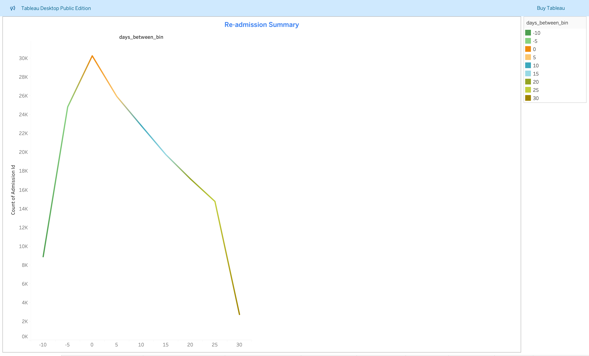
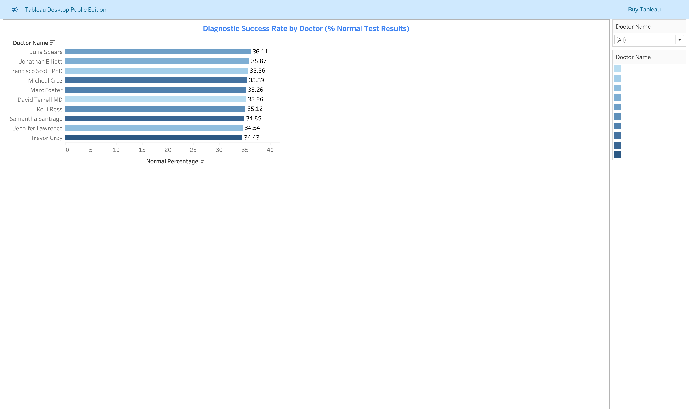
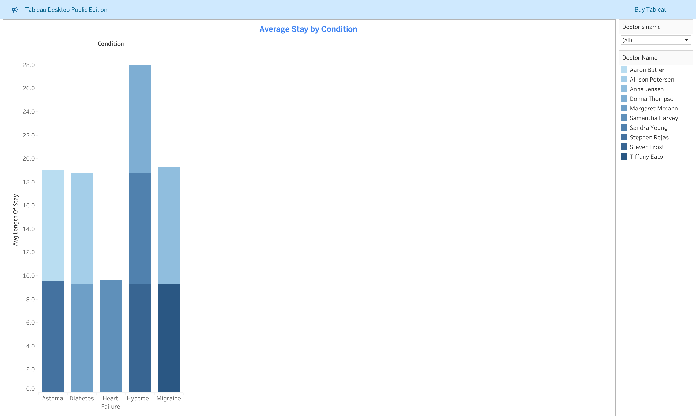
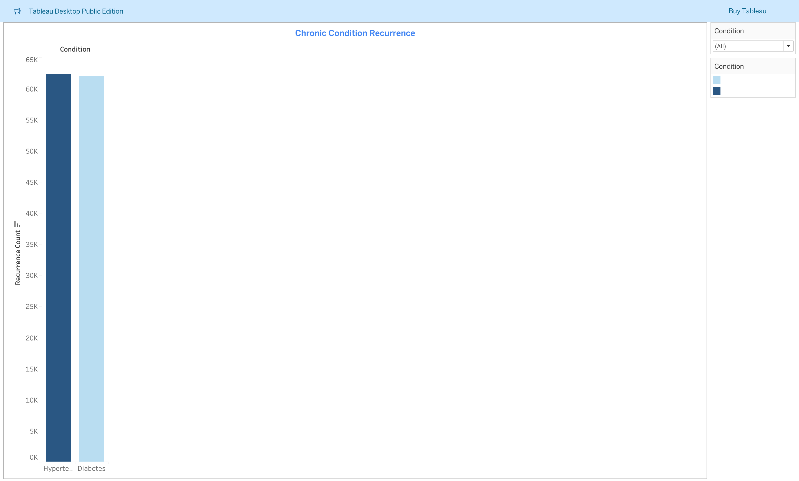
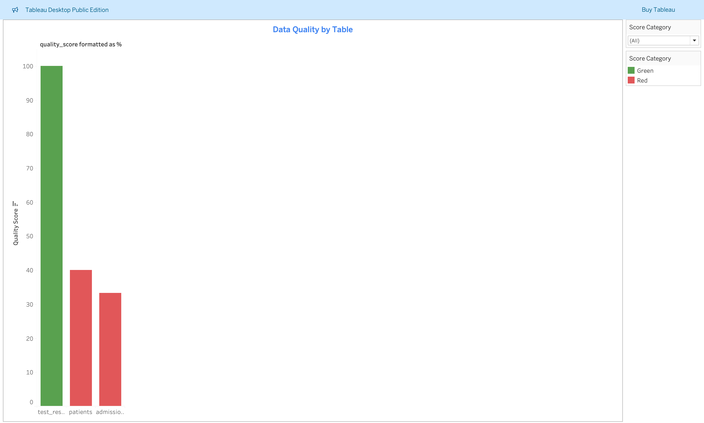
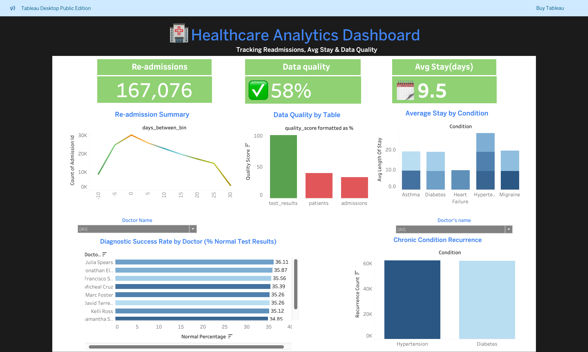

#  🏥 Healthcare-analytics-project
Uncovering Patterns in Patient Readmissions, Doctor Effectiveness, and Condition Severity Using SQL 

## 📌 Overview  
This project simulates a **Healthcare Analytics System** using synthetic data.  
It is designed to demonstrate **SQL problem-solving**, **data quality tracking**, and **Tableau dashboards** for real-world healthcare insights.  

The dataset is generated with Python (`faker` library) and consists of multiple related tables such as **patients, admissions, doctors, medical conditions, and test results**.  

---

## Database Schema  

### **Tables**
- **Patients** → `patient_id, name, age, gender`  
- **Admissions** → `admission_id, patient_id, doctor_id, admission_date, discharge_date`  
- **Doctors** → `medical_conditions, patients, test_results`  
- **Medical_Conditions** → `condition_id, admission_id, condition`  
- **Test_Results** → `test_result_id, admission_id, test_name, result`  

---

## 🔍 Problem Statements Solved  

1. **Readmission Risk Tracking** – Patients readmitted within 30 days. The total number of re-admission was 167,076. 
2. **Diagnostic Success Rate per Doctor** – Doctors with highest % of “Normal” results. For example, Dr. Julia Spears had the highest success rate, 34.11% .
3. **Length of Stay by Doctor & Condition** – Avg stay per doctor & condition. Average length of stay of patients was 9.5days.  
4. **Condition Recurrence Analysis** – Recurrence of chronic conditions. 62500 re-ocurrence of hypertension case was documeneted. 
5. **Dirty Data Tracking** – Data quality score across tables. Data quality score was 58%.  

---

## 🗂️ SQL Views  

- `readmissions_within_30_days`  
- `doctor_diagnostic_success_rate`  
- `avg_stay_by_doctor_condition_view`  
- `chronic_condition_recurrence`  
- `data_quality_summary`  

---

## 📌 Business Question  
How can healthcare providers reduce patient risks, improve doctor performance, optimize hospital stays, and ensure data quality while complying with healthcare standards?  

---

## 🎯 Objectives  
- Identify patients at high risk of readmission within 30 days.  
- Measure diagnostic success rates by doctor.  
- Track average hospital stay by doctor and condition.  
- Analyze recurrence of chronic conditions such as Hypertension and Diabetes.  
- Evaluate data quality across all healthcare records.  

---

## 👥 Stakeholders  
- **Hospital Administrators** – Improve efficiency, reduce costs.  
- **Doctors** – Track performance and patient outcomes.  
- **Patients** – Receive better care and reduced risks.  
- **Data Governance Teams** – Ensure compliance and improve data quality.  
- **Policy Makers** – Inform health policies with data-driven insights.  

---

## ⚙️ Tech Stack

---

- **Python** → Data generation with `faker`, `pandas`  
- **PostgreSQL** → Data storage + SQL queries & views  
- **Tableau** → Visualization & dashboarding  

---

## 📊 Key Insights from Analysis  

### 1️⃣ Readmission Risk Tracking  
- Total number of 30-day readmissions: **167,076**.  
- Readmissions are especially high among chronic patients (e.g., Diabetes, Hypertension).  

  

---

### 2️⃣ Diagnostic Success Rate per Doctor  
- Dr. **Julia Spears** had the highest success rate with **34.11%** “Normal” results.  
- Large variability exists across doctors, indicating differences in diagnostic accuracy.  

  

---

### 3️⃣ Length of Stay by Doctor & Condition  
- Average length of stay: **9.5 days**.  
- Certain doctors and conditions are associated with longer hospital stays.  

  

---

### 4️⃣ Condition Recurrence Analysis  
- Hypertension recorded **62,500 re-occurrences** across multiple admissions.  
- Chronic condition recurrence is a key driver of readmissions and extended care costs.  

  

---

### 5️⃣ Dirty Data Tracking  
- Overall **data quality score: 58%**.  
- High levels of missing values in test results, discharge dates, and patient demographics.  

  

---
### Main Dashboard  

---

## 💡 Impacts & Recommendations  

- **Readmission Risk** → Implement post-discharge follow-up programs for chronic patients.  
- **Doctor Performance** → Standardize diagnostic procedures and provide training for doctors with lower success rates.  
- **Hospital Efficiency** → Monitor and reduce long stays through early intervention and discharge planning.  
- **Chronic Conditions** → Launch preventive care initiatives for Hypertension and Diabetes.  
- **Data Quality** → Invest in better EHR systems, mandatory field entry, and regular audits to raise the score above 90%.  

---

## 📝 Final Thoughts  
This project demonstrates how SQL, data modeling, and visualization in **Tableau** can be used to extract actionable insights from healthcare datasets.  

The analysis highlights **critical risks in readmissions, condition recurrence, and data quality**, while also revealing clear opportunities for **policy changes, doctor performance tracking, and improved patient outcomes**.  

By addressing these issues, healthcare providers can move toward a **data-driven, patient-centered system** that lowers costs and improves quality of care.  

---

👉 **Next Steps**: Deploy these dashboards into a hospital management reporting system for **real-time monitoring** of risks and quality metrics.

